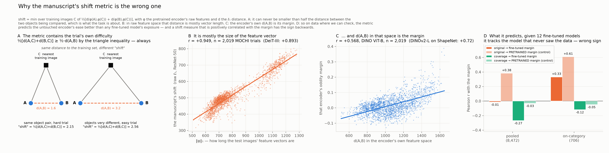
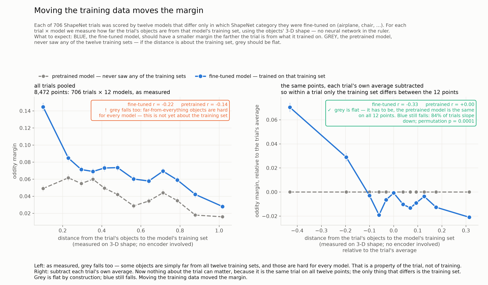
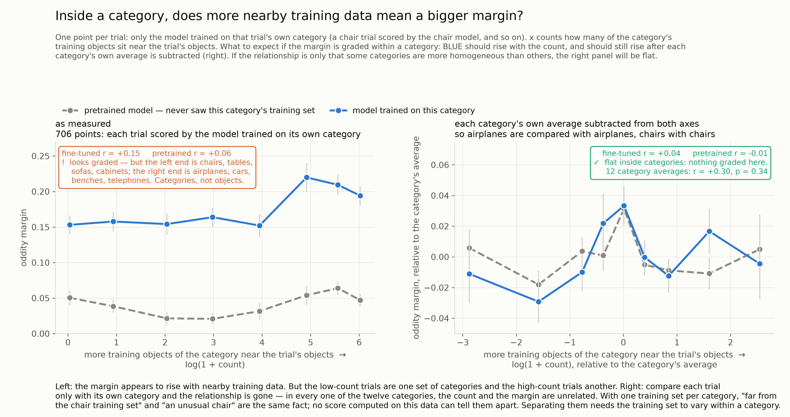

# Distribution shift and the oddity margin
*Last meaningful update: 2026-09-19 · Lead: TB · Status: active* · history: [states/](states/README.md) · log: [REASONING.md](REASONING.md) · what we have: [RESOURCES.md](RESOURCES.md)

## Goal
Find a good estimate of distribution shift — how far a test trial sits from what a model was trained on — and establish whether it tracks the model's oddity margin. If it does, the margin is a readout of representational support, and "support depends on training data" becomes a claim we can test by changing the training data rather than just correlate.

## Status

**Where we started.** The manuscript's shift estimate is computed inside the encoder whose margin it explains: nearest-neighbour distance in DINOv2 feature space, in the form ½[d(A,C)+d(B,C)] over training images C. That form has a floor — by the triangle inequality it can never be smaller than ½·d(A,B), the very thing the oddity task is decided by — and in raw feature space it is mostly the size of the feature vector (r = 0.95 with ‖φ‖₁). On our data it predicts the *pretrained* model's margin (+0.38 pooled, +0.61 on-category) better than any fine-tuned model's, with the sign backwards. It measures how easy the trial is for the encoder, not shift [[D06](REASONING.md#D06)].

**What we did about it.** Two changes. (1) A new estimate: never difference A and B — average a per-image quantity over the trial's images — and count *coverage*, the training mass within a radius of each image, rather than distance to the nearest neighbour. (2) A model-free space: the descriptors come from the stimuli's known 3D geometry (ShapeNet voxels), so no encoder is anywhere in the ruler [[D02](REASONING.md#D02), [D05](REASONING.md#D05)].

**Where it works.** With 12 category-specific fine-tunes and every trial run through all 12, the stimulus is held fixed while the training set varies. The margin follows the training set in 84% of trials (permutation p = 10⁻⁴), accuracy falls 81 → 56% from the nearest to the farthest training set while the pretrained model stays flat at 51%, and the base-model control — the thing the original metric fails — is zero by construction. Coverage is the only estimate whose *pooled* relationship also passes that control (−0.27 vs a control of −0.03) [[D02](REASONING.md#D02), [D05](REASONING.md#D05)].

**Where it fails.** Within a condition. Hold the category fixed and ask whether a chair farther from the chair training set gets a lower margin from the chair model: r ≈ 0 for every estimator, after category centring. The one curve that looked graded sorts trials by category, not by anything within one [[D03](REASONING.md#D03), [D07](REASONING.md#D07)]. This matters: without a within-condition result, what we have shown is *category* shift — did you train on this kind of object — not distribution shift as a continuous quantity.

**Why it fails.** With one training set per category, "far from the training set" and "an unusual object" are the same variable; no estimator can separate them. Two exhaustive searches said so. The fix is not a better metric but a finer-grained assay — training sets that vary *within* a category — which is the current work [[D09](REASONING.md#D09)].

## Strategy

The within-trial design worked because it varied the training set with the stimulus fixed. The within-category question needs the same move one level down: vary the training set *within a category*, with the trial fixed, and ask whether the margin follows coverage. Three tracks, all reusing the collaborator's fine-tuning pipeline unchanged (same backbone, LoRA, loss, epochs), so the new models are comparable to the twelve we have.

**1 · Support knockout** — does removing a trial's support lower its margin? For chair, airplane and table: split each category's test objects into four random groups; for each group and k ∈ {10, 50}, fine-tune on the category minus every group member's k nearest training objects. k = 10 removes ~10–16% of the bank and raises the group's own kNN distance 3–4× more than other groups' and 5× more than a size-matched random removal (two random-removal controls per category). 30 fine-tunes; each trial ends up scored under 11 training sets spanning Δdistance 0 to +0.2, stimulus fixed. Prediction: the margin drops for own-group knockouts in proportion to coverage lost, and not for other-group or random removals of the same size. Batch 1 running (pilot 8519673 + 21 jobs, k = 10 and random controls; `../knockout/logs/batch1_jobs.txt`); k = 50 held [[D14](REASONING.md#D14)].

**2 · Knock-in** — does adding the right data raise it, and can the metric choose the data? From pretrained DINOv2-L, fine-tune on 8 random subsets of 100 chairs, 6 targeted subsets (the 100 nearest chairs to each of six low-margin chair trials; 2–3× closer than any random subset), and 6 cross-category controls (the 100 nearest airplanes). The random runs make the metric comparison free: every candidate estimate — coverage radius, kNN k, descriptor, object vs image level — is recomputed on the same runs, within trial, and the one that best predicts margin *change* wins. The targeted runs then test whether that metric is actionable. 20 fine-tunes, designed in `../knockout/design_knockin.json`; the single-trial figure (the trial, the chairs the metric chose, pretrained vs targeted vs random margins) is the intended headline.

**3 · Encoder-space upper bound** — is the within-category signal there at all? Features of all 311k training renders and the MOCHI images under pretrained DINOv2-L and the chair/airplane/table fine-tunes (job 8519397). If the chair model's own representation shows no within-category distance→margin relation, no descriptor will and the descriptor search is over.

**Budget and order.** One fine-tune is ~2 GPU-hours including evaluation (~3 min/epoch): $9 unsubsidised / $2 subsidised on a full B200; all 50 runs ≈ $450 / $100 [[D12](REASONING.md#D12), [D14](REASONING.md#D14)]. Order: random knock-in subsets → knockout k = 10 → targeted and cross knock-ins → knockout k = 50. Training hyperparameters stay pinned; each condition gets its own similarity table so mining fills every epoch; evaluation is chained into each job.

## Resources used, and what the plan will cost
**Used so far.** Agent ≈ 34 h; lead ≈ 11 h (a guess: reviewing, dictating direction, reading the artifact and these files). Compute: 4 GPU-h + 250 CPU-core-h ≈ **$25 unsubsidised / $6.50 subsidised** — the entire analysis phase, Acts 1–8, cost under $10; the rest is today's extraction and pilot. Ledger: `background/compute_ledger.csv`.

**The plan as designed** (one fine-tune ≈ 2 GPU-h incl. evaluation; rates in [RESOURCES.md](RESOURCES.md)):

| | runs | GPU-h | $ unsub | $ sub |
|---|---|---|---|---|
| batch 1 — knockout k = 10 + random controls + random knock-ins (submitted) | 22 | 44 | 200 | 44 |
| batch 2 — targeted and cross-category knock-ins | 12 | 24 | 108 | 24 |
| batch 3 — knockout k = 50 (held pending batch 1) | 15 | 30 | 135 | 30 |
| **core plan** | **49** | **98** | **≈ 440** | **≈ 100** |
| optional: second knock-in dose N = 25 | 8 | 16 | 72 | 16 |
| optional: epochs ablation (10 vs 30) | 2 | 4 | 18 | 4 |
| optional: targeted runs with the runner-up metric | 6 | 12 | 54 | 12 |
| optional: second seed for the 12 category models (noise floor) | 12 | 24 | 108 | 24 |
| **everything** | **77** | **154** | **≈ 700** | **≈ 155** |

The core plan is ~6M billing-minutes, 10 % of the account's annual cap (17 % used before it); everything is ~16 %. Time to finish the core plan: ≈ 10–20 h wall at 6–8 jobs in parallel, plus ≈ 10–15 agent-hours of analysis and figures and ≈ 3–5 lead-hours of review.

## Next steps
- [x] Pilot epoch time → run budget: ~3 min/epoch, all 50 runs affordable [D12]. (Claude)
- [ ] Encoder-space within-category test from the extracted features. (Claude)
- [x] Build subset dirs and per-condition similarity tables; verify chained evaluation; submit batch 1 [D14]. (Claude)
- [ ] Route targeted/cross knock-ins by the mig45 timing; decide on k = 50 from the k = 10 results. (Claude)
- [ ] Analysis script for knockout and knock-in results (within-trial regressions of Δmargin on Δcoverage; own vs other vs random). (Claude)
- [ ] Metric comparison on the random knock-in runs; targeted runs with the winner and runner-up. (Claude)
- [ ] Single-trial figure. (Claude)
- [ ] Lab meeting Monday: walk [states/](states/README.md) 0 → 5. (TB)
- [ ] Decide the resubmission's framing — claim category coverage now, or wait for the within-category result; r64w's reframing advice is the live constraint [[D11](REASONING.md#D11)]. (TB)

## Open questions
1. Is the within-category relationship graded once the training set varies?
2. Which estimate best predicts margin *change* under intervention?
3. Does the encoder's own space carry a within-category signal that geometry misses?
4. What is the margin's noise floor? One model per category, no repeat seeds; the 0.13 within-category ceiling could be noise.
5. Does view-invariance hold beyond ~25° from the training grid? (Needs new renders.)

## Pointers
- This repo: estimator `blind_shift.py`; coverage `scratch/coverage_sweep.py`; viewpoint `scratch/viewdepth_pipeline.py`; cited figures in `evidence/` with provenance; full factual record `README_findings.md`; walkthrough artifact https://claude.ai/artifact/6AhaQJwZjQoZnYEXsBWT9r.
- Experiments: `../knockout/` (`design.json`, `design_knockin.json`, `scripts/`).
- Upstream: collaborator pipeline `../../Dist-shift/HIDA/hida-tune/` (read-only); category results `ShapeNet_OOD_Analyses/<cat>/ood_analysis_results.csv`; metric audit `../L1norm_vs_distshift/README.md`; the manuscript `Human-3D-generalization-copy/paper-to-follow-*/`.
- Background: `background/` — narrative back-fill, citation list, slot for the MOCHI project's STATE.md.
