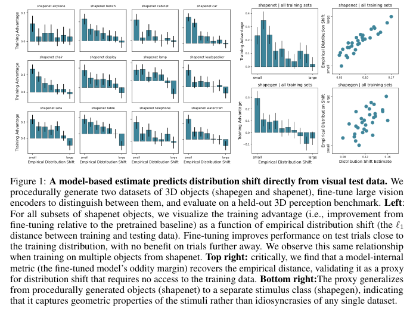

# State 0 — The manuscript, and why we opened it up
*Snapshot as of the submission's rejection · Lead: TB* · [index](README.md) · [resources](../RESOURCES.md) · next → [State 1](01-what-the-metric-measures.md)

## Goal
Characterise human visual perception through distribution shift — the distance between what a system was trained on and what it is tested on. In a setting where both are known (3D object datasets, fine-tuned vision encoders, the MOCHI benchmark), show that a distance between train and test data predicts model performance, build a proxy for that distance computable from test images alone, and use the proxy to ask when humans outperform models and why.

## Status
**What the manuscript claimed** (*Humans adapt to distribution shift with increasing test-time compute*, NeurIPS 2026 submission):
1. An empirical distribution shift — nearest-neighbour ℓ₁ distance from a MOCHI trial to the fine-tuning set, in the pretrained encoder's feature space — predicts the benefit of fine-tuning: large close to the training data, none far away (Fig. 1 left).
2. A model-internal quantity, the fine-tuned model's oddity margin, recovers that empirical shift (r = .91 shapenet, .62 shapegen; Fig. 1 right) — so distribution shift can be estimated from test images alone.
3. Applied to large pretrained encoders, the proxy predicts when humans beat models and how long humans take; restricting viewing to a glance collapses humans to model level.

**The reviews** (NeurIPS 2026; three reviewers; paraphrased in [background/reviews-neurips2026.md](../background/reviews-neurips2026.md)). All three found the human results real and the statistics sound. All three had trouble with the central term.
- *SCwg:* the margin would be more accurately called "inter-class distance", and every result would survive that renaming — which removes the novelty. "Distribution shift" is never defined in the main text.
- *r64w:* the results are consistent with there being no distribution shift at all — both quantities might just measure how unusual an example is, one within the test set, one across train and test. Proposed a control: run both metrics on two random halves of one dataset. Asked what an object-based measure averaged over all views would do. After the rebuttal: still uncertain what "distribution shift" means here; not a minor revision; resubmit after a large reframing, or drop the framing.
- *HVBU:* overclaims; many shift metrics already exist and none were compared; the scope is one task.

**How it read to us at the time.** Honestly: not fully clear. The reviewers' language was hard to interpret — "inter-class distance", "weirdness within a set", "no shift at all" — and it was not obvious whether these were the same objection or three different ones, or what experiment would answer them. The sensibility after reading them was that the work was right and had been miscommunicated: that a clearer definition of the empirical shift and the proxy, and better figure labelling, would resolve most of it. Two things were nonetheless nagging. r64w's construction — that the correlation would appear even with no shift — could not be dismissed by rewording. And the in-house audit (`L1norm_vs_distshift/`) had independently found that the empirical shift correlates with the size of the test images' feature vectors at r = 0.95 (ResNet-50), which is not a communication problem.

## Strategy
Roll up our sleeves. Rather than argue the reviews, take the metric apart and find out what it measures — if we were right, that will show it, and if not, we would rather know. Work in the tractable setting first — ShapeNet trials, twelve category-specific fine-tunes — where the training data and the stimulus geometry are both known, so any confound can be named.

## Resources used
| | this state | cumulative |
|---|---|---|
| agent time | 0 h | 0 h |
| lead time (guess) | 1 h | 1 h |
| compute, unsub / sub | — | — |

Nothing on the ledger; inherited assets only (12 fine-tunes ≈ 25 GPU-h by the collaborator). Lead time: reading the reviews and deciding to open the metric up.

## Next steps
- [ ] Reproduce Fig. 1 right from the stored margins and distances.
- [ ] Ask what the metric is bounded by, and what it correlates with besides the training set.
- [ ] Look for a way to measure distance to the training data that does not go through the encoder.

## Open questions
- Does the empirical shift measure the training set, or the encoder?
- Are the three reviewers making one objection or three? What would r64w's two-halves control show on our data?
- Is there any distance that could be computed without the encoder at all?
- If the metric is wrong, does the human result (claim 3) survive?
