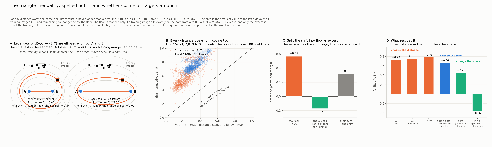

# What the manuscript's shift metric actually measures
Taking the metric apart before defending it: it is bounded by the trial's own difficulty, it mostly tracks feature-vector size, and it is validated against the same encoder — and no choice of distance escapes the first of these.

*Snapshot: after taking the metric apart · Lead: TB* · ← [State 0](00-the-manuscript.md) · [index](README.md) · [resources](../RESOURCES.md) · next → [State 2](02-a-form-that-escapes-the-bound.md)

## Goal
Find a way to use the oddity margin as a proxy for distribution shift — the distance between what a model was trained on and what it is tested on — and establish that it really is one: a shift estimate the margin tracks, computed in a way that cannot be gamed. The NeurIPS reviews questioned whether the manuscript's estimate measures shift at all. We are working out how much of that to take on board and how much to set aside, by testing rather than arguing.
## Status
**We took the manuscript's number apart, and there is something wrong with it.** The metric is ½[d(A,C) + d(B,C)] over training images C, with A the matched object and B the oddity, d the ℓ₁ distance in the encoder's raw features, C the training image minimising the sum. Three things are wrong with that number, and each lets it be large without the trial being far from the training data.

**1 · It contains the trial's own difficulty.** For any distance, the direct route is never longer than a detour: d(A,B) ≤ d(A,C) + d(C,B). Halve it: the shift can never be smaller than ½·d(A,B) — the difference between the two objects, which is what the oddity task is decided by. The floor is reached only if a training image lies exactly on the path from A to B, so shift = ½·d(A,B) + excess, and only the excess is about the training set. For L2 the level sets are ellipses with A and B as foci; move the objects apart and every ellipse grows, training images included. In data: the floor holds in 100% of trials, r(shift, d(A,B)) = 0.73, and half the shift's variance is the floor [[D06](../REASONING.md#D06)].

**2 · It is mostly the size of the feature vector.** r(shift, ‖φ‖₁) = 0.95 for ResNet-50 [[D01](../REASONING.md#D01)].

**3 · It is validated against itself.** The proxy is the encoder's margin; the target is computed in the same encoder's features; and the encoder's own d(A,B) — the floor — *is* the margin (r = +0.57 across all 2,019 trials). Decomposed: the floor predicts the pretrained margin at +0.57 (wrong sign), the excess at −0.17 (right sign), and their sum lands at +0.32 [[D06](../REASONING.md#D06)].

**In hindsight, one review reads differently.** SCwg's "the margin is inter-class distance, and every result survives the renaming" may be exactly this: the floor is the inter-object distance, and it is the part that carries the correlation. At the time that sentence read as a naming quibble. It was not.

**Does cosine or L2 get around it?** No — the bound is a property of every metric. Recomputed under three distances the floor holds in 100% of trials for all three and cosine is slightly worse (r with d(A,B) 0.78). Normalising the features fixes the norm problem and leaves the floor exactly where it was.

## Strategy
Fix the *form* first: never difference A and B. Average a per-image quantity over the trial's images, so the task's decision variable cannot enter. Test whether that alone is enough, in the encoder's own space.

## Resources used
| | this state | cumulative |
|---|---|---|
| agent time | 3 h | 3 h |
| lead time (guess) | 2 h | 3 h |
| compute, unsub / sub | $4.60 / $1.40 | $4.60 / $1.40 |

Compute: the feature-norm audit, 103 CPU-core-h + 0.4 GPU-h. No new models.

## Next steps
- [ ] Build the oddity-blind estimator (mean over images of distance to the k nearest training items).
- [ ] Check its correlation with d(A,B) and with the pretrained margin in encoder space.
- [ ] If the encoder's space still leaks, leave it.

## Open questions
- Is the form the whole problem, or does the space contribute too?
- Where does the genuine excess signal (−0.17) go once the floor is removed?
