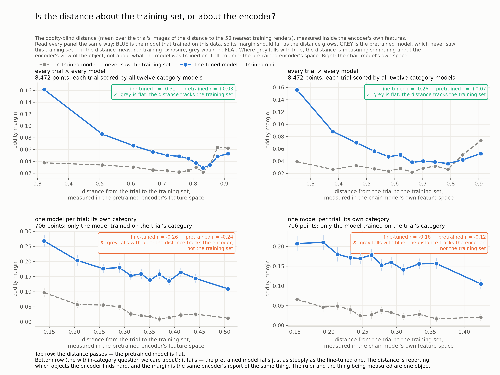

# A shift estimate that is not bounded by the trial's difficulty
Averaging over the trial's images instead of differencing A and B removes the floor by construction. It works better inside the encoder's own space than we first thought — and looking at it there is what showed us the problem has two parts, the estimate and the space, and that we wanted a space with no encoder in it.

*Snapshot: after the estimator changed · Lead: TB* · ← [State 1](01-what-the-metric-measures.md) · [index](README.md) · [resources](../RESOURCES.md) · next → [State 3](03-a-model-free-ruler.md)

## Goal
Find a way to use the oddity margin as a proxy for distribution shift — the distance between what a model was trained on and what it is tested on — and establish that it really is one: a shift estimate the margin tracks, computed in a way that cannot be gamed. The NeurIPS reviews questioned whether the manuscript's estimate measures shift at all. We are working out how much of that to take on board and how much to set aside, by testing rather than arguing.
## Status
**The problem has two parts, and we had been treating them as one.** Taking the manuscript's number apart (State 1) left two separable questions: *how* the shift is estimated — the form of the number — and *where* it is computed — the space in which trials and training data are encoded. The manuscript's metric fails on both. They have to be fixed separately, and it is worth being clear which fix does what.

**Part one, the form.** For each image in the trial, the mean distance to its 50 nearest training items; then the mean over the trial's images. No A/B roles, nothing differenced, so no ½·d(A,B) floor by construction. Cosine on unit-normalised features, so vector length cannot enter either [[D02](../REASONING.md#D02)].

**What that buys inside the encoder's own space.** Computed in DINOv2-L features against the training bank the models saw, the oddity-blind form does most of what we asked of it. The figure below is one plot type repeated four times: distance from the trial to the training set, measured in an encoder's features, against the oddity margin of the model trained on that set (blue) and of the pretrained model that never saw it (grey). The expectation is the same in every panel — blue should fall, and if the distance is about the training set, grey should be flat. Top row: it is. Pooled over all trials and all twelve category models, the pretrained margin is flat (r +0.03 in the pretrained encoder's space, +0.07 in the chair model's own) — the control the manuscript's metric fails [[D15](../REASONING.md#D15)]. The right-hand end of both top panels turns up a little, which we noted and let go.

**The concern that did not go away.** Bottom row, restricted to each trial's own-category model — the within-category question we actually care about — grey is not flat: it falls about as steeply as blue (−0.24 vs −0.26 in the pretrained space; −0.12 vs −0.18 in the chair model's). This is not a conclusive result against the encoder-space estimate, and we do not want to treat it as one; nor is the fact that the fine-tuned correlation is a bit stronger than the pretrained one the kind of evidence we are after — a comparison of two coefficients is not an understanding of what the distance is measuring. What the bottom row does is make us pause. It is consistent with the distance reporting which objects the encoder finds hard, with the margin being the same encoder's report of the same thing — the ruler and the thing measured being one object — and while it stays like this we cannot say we have separated the training set from the encoder. We record it as a persistent, unresolved concern rather than a kill, because that is what it was [[D16](../REASONING.md#D16)].

**Why we moved on anyway.** Not because the form fix failed — it largely worked — and not because the bottom row settled anything, but because the space is the second problem and a fixed form does not solve it. An estimate computed in the encoder's features is still a property of the encoder: it cannot be checked against anything the encoder does not see, it inherits whatever the encoder has learned about typicality, and it can never be applied to a system whose encoder we cannot open — which is the human, the point of the paper. A lot of search sat behind this step — variants of the form, of k, of the distance — that is not reported here; the figure above is the one that made the decision, and the bottom row of it is the concern we carried forward.

**In hindsight.** r64w's suggestion of running both metrics on two random halves of one dataset is a version of the control that the form fix passes and the original metric fails; and their question about an object-based measure averaged over views is the next thing we built.

## Strategy
Fix the second part: leave the encoder's space. MOCHI's ShapeNet and ShapeGen trials come from known 3D assets, so distance to the training data can be measured on the *stimuli* — descriptors computed from the objects' geometry, with no encoder and no learned parameter anywhere in the ruler. The encoder then appears only where it should: as the thing being measured. Keep the encoder-space version as the comparison: if geometry ever does worse than the encoder's own space, that tells us what the descriptors are missing.

## Resources used
| | this state | cumulative |
|---|---|---|
| agent time | 2 h | 5 h |
| lead time (guess) | 5 h | 8 h |
| compute, unsub / sub | $8 / $1.90 | $12.60 / $3.30 |

Compute: the first shift computations (`clean_shift`, `cosshift`) and, for the figure above, one feature-extraction job (1.7 GPU-h) — run later, placed here because this is the decision it informs. No new models.

## Next steps
- [ ] Voxel-based descriptors for every ShapeNet object (rotation-invariant and raw-grid variants); silhouette descriptors for ShapeGen.
- [ ] A training bank of the 20,885 objects the category models actually saw, MOCHI objects excluded.
- [ ] The oddity-blind estimator on those descriptors; the base-DINOv2 control on every row.

## Open questions
- Will a geometric ruler predict anything about a model trained on images?
- How to separate "far from this training set" from "an unusual object" — in the encoder's space they are nearly the same distance.
- The encoder's space shows a small within-category signal (category-centred r ≈ −0.1); will geometry?
