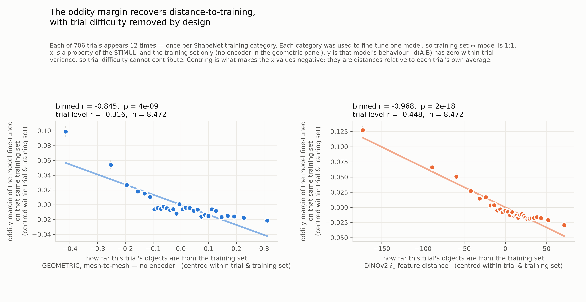
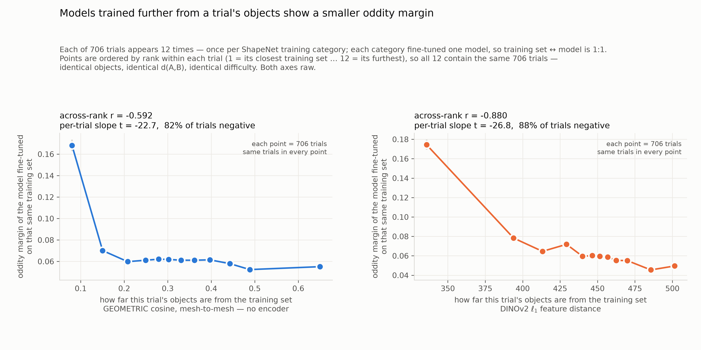
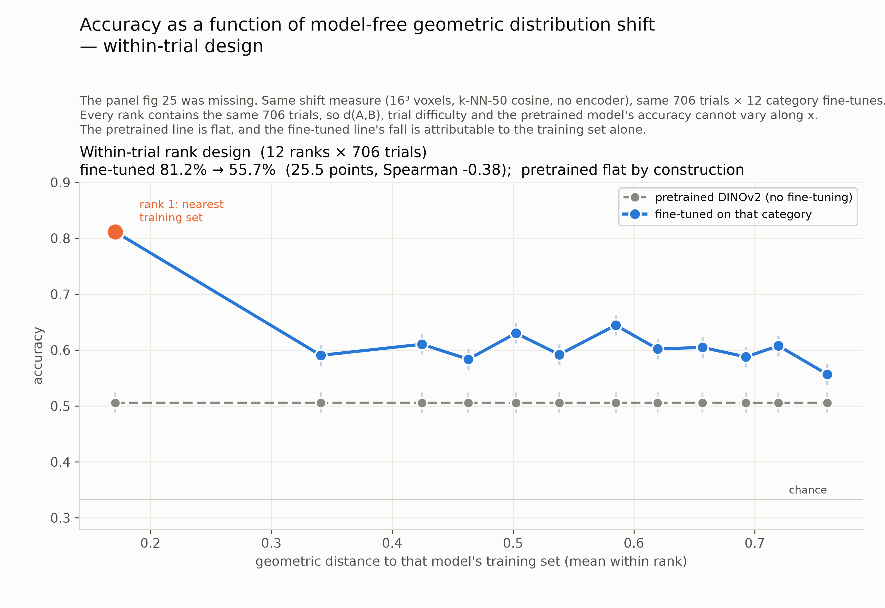

# A model-free ruler, and a design in which the control is exact
Distance measured on the stimuli's geometry, with no encoder in the ruler; and, because every trial runs through all twelve category models, a within-trial design in which the base model's margin is flat by construction and the fine-tuned margin still falls.

*Snapshot: after the within-trial result · Lead: TB* · ← [State 2](02-a-form-that-escapes-the-bound.md) · [index](README.md) · [resources](../RESOURCES.md) · next → [State 4](04-coverage.md)

## Goal
Find a way to use the oddity margin as a proxy for distribution shift — the distance between what a model was trained on and what it is tested on — and establish that it really is one: a shift estimate the margin tracks, computed in a way that cannot be gamed. The NeurIPS reviews questioned whether the manuscript's estimate measures shift at all. We are working out how much of that to take on board and how much to set aside, by testing rather than arguing.
## Status
**The ruler.** Descriptors from ShapeNet's 128³ solid voxelisation — a 57-d rotation-invariant shape distribution and raw occupancy grids at 8³/16³/32³ — z-scored against the training bank, L2-normalised, cosine distance, oddity-blind estimator [../REASONING.md#D01, ../REASONING.md#D02].

**The first look was too good, then failed its control.** Pooled over all 8,472 (trial × model) observations the margin fell cleanly with distance (binned r −0.84) — and so did the pretrained model's margin (r −0.121 vs −0.135 fine-tuned). The pooled relation is a stimulus property: objects far from every training set are hard for every model [../REASONING.md#D02].

This is, we now think, what r64w was describing: a correlation that appears because both quantities measure how unusual the example is, with no shift required. The reviewer's proposed control — two random halves of one dataset — is a version of ours: a model that never saw the training set must not be predicted. Their construction checks out on our data.

**The design that fixes it.** Every trial was run through all 12 category fine-tunes. Within a trial the images, the objects, d(A,B), the human data and the pretrained margin are all constants (sd = 0). So rank or centre within trial: every trial-level property — the control included — becomes a flat line *by construction*, and what varies is only which training set the model saw. The fine-tuned margin still falls.

**The formal version.** One slope per trial: 84.1% negative, permutation null from 10,000 within-trial shuffles p = 10⁻⁴, cluster bootstrap over the 12 training categories [−0.22, −0.03]. Accuracy 81.2% → 55.7% from nearest to farthest training set, the pretrained model pinned at 50.6%. On- vs off-category margin advantage +0.134 vs +0.019, d = 1.41. Base-DINOv2 control on the same axis: 4×10⁻¹⁸ [../REASONING.md#D02].

**Robustness.** Seven centring schemes, eight representations (including the 57-d invariant descriptor at 82% of slopes negative), nine estimators, one-scalar descriptors, per category: the same curve. A 1,895-candidate cross-validated search could not beat the simplest metric [../REASONING.md#D03].

## Strategy
Two things remain. The pooled rows — the single-model view a paper would naturally show — still fail the control. And the rank curve is mostly a step (on-category model far above the rest): is there anything graded beyond category membership? Look for an estimate that behaves in the pooled row, and look at the on-category row directly.

## Resources used
| | this state | cumulative |
|---|---|---|
| agent time | 13 h | 18 h |
| lead time (guess) | 2 h | 10 h |
| compute, unsub / sub | $3.70 / $1.20 | $16.30 / $4.50 |

Compute: descriptor banks (`hida_bank` 114 core-h), representation variants, pose features; the 10k-permutation analysis on the login node. All results from the 12 inherited fine-tunes.

## Next steps
- [ ] An estimate whose pooled relationship passes the base-DINOv2 control.
- [ ] The on-category row: one point per trial, only the model trained on the trial's own category.

## Open questions
- Is the within-trial effect "which category" or a graded function of distance?
- Why does every pooled metric leak object atypicality, and can a different estimator stop it?
