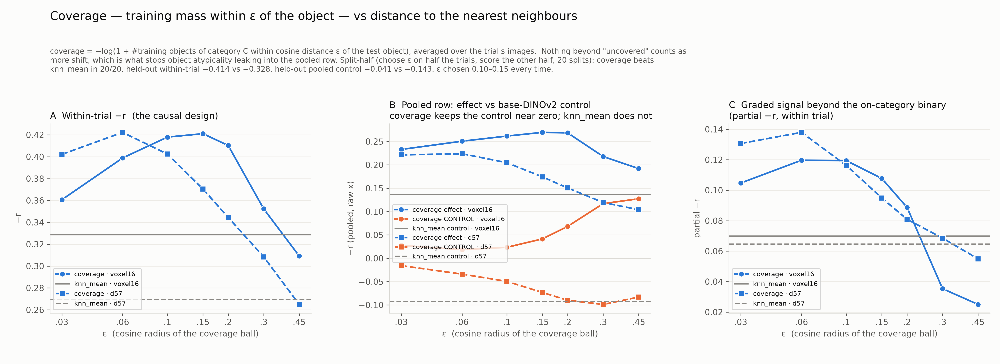
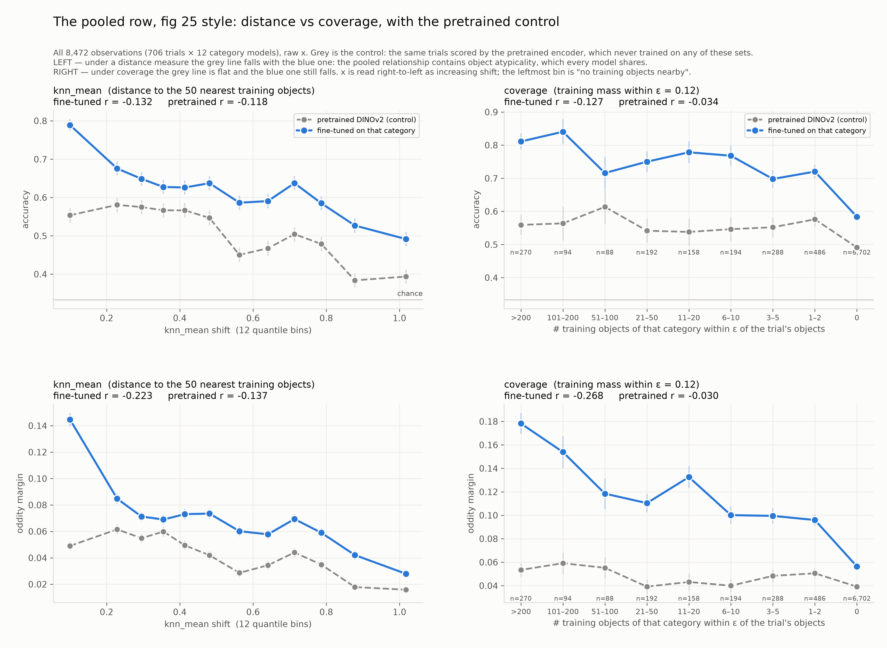
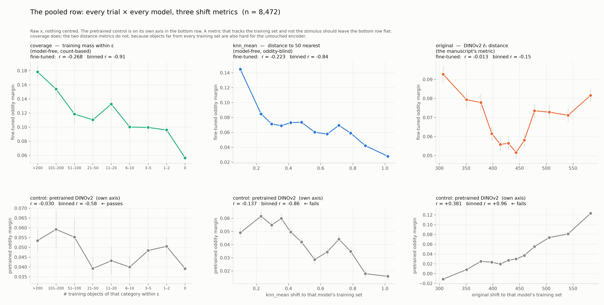
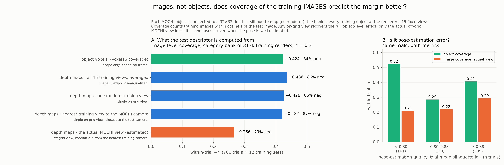

# Coverage: counting training mass rather than measuring distance
A coverage estimate passes the control in the pooled row where every distance measure failed; two earlier claims are corrected; and a test of whether support is view-conditioned comes back negative within the training grid.

*Snapshot: after the coverage result · Lead: TB* · ← [State 3](03-a-model-free-ruler.md) · [index](README.md) · [resources](../RESOURCES.md) · next → [State 5](05-the-within-category-limit.md)

## Goal
An estimate of distribution shift that passes the control in the pooled row, not only within trial — so that a single model's margin can be read against it.

## Status
**Coverage, not distance.** Every estimator so far asked *how far* the nearest training objects are. Coverage asks *how much* training mass is near the object: count the category's training objects within a cosine radius ε of each image, take −log(1+count), average over the trial. The difference is the ceiling — "no training objects nearby" is the most shift there is — so object atypicality saturates instead of spreading, and stops leaking into the pooled row [../REASONING.md#D05].

| voxel16 | kNN distance | coverage |
|---|---|---|
| within-trial r | −0.329 | **−0.424** |
| pooled r / pretrained control | −0.223 / −0.137 | **−0.268 / −0.030** |
| held-out (ε chosen on the other half) | −0.328 | −0.414, wins 20/20 |

**Three metrics side by side.** Coverage, kNN, and the manuscript's original per-category distance, with the pretrained control on its own axis. The original metric's control rises with it (binned +0.96; r +0.38 pooled, +0.61 on-category) and its fine-tuned curve is U-shaped — it behaves only after two-way centring [../REASONING.md#D06].

**Images, not objects?** Hypothesis: encoders learn view-conditioned appearance, so coverage should count training *images*. Built model-free (depth maps projected from voxels; MOCHI cameras recovered by silhouette matching, IoU 0.86). Any on-grid view recovers the full effect (−0.42 to −0.44); only the actual off-grid MOCHI view loses it (−0.27), not from pose error. Within the training grid's ~25° gaps, support is view-invariant [../REASONING.md#D08].

r64w had asked what an object-based measure averaged over all views would do. This is that measure, and it does at least as well as the view-conditioned one — the reviewer's question turned out to be the right test of the hypothesis.

**Correction carried forward.** With the oddity-blind form, the shapegen encoder comparison from State 0's reproduction goes from |r| 0.74 to 0.12: it had been d(A,B) at r = 0.993. Withdrawn [../REASONING.md#D06].

## Strategy
The on-category row under coverage looks graded (binned r −0.78). Test whether it is — category-centre it, look inside each category — before claiming a within-category result.

## Resources used
| | this state | cumulative |
|---|---|---|
| agent time | 9 h | 27 h |
| lead time (guess) | 3 h | 7 h |
| compute, unsub / sub | $0.20 / $0.10 | $8.70 / $2.80 |

Compute: coverage sweeps on the login node; the depth-map pipeline, six `genoa-std-mem` jobs. Still no new models.

## Next steps
- [ ] Category-centred and per-category versions of the on-category coverage curve.
- [ ] The strongest within-category test the data allow: pretrained margin partialled out of both sides.

## Open questions
- Is the on-category curve a within-category relationship, or category identity?
