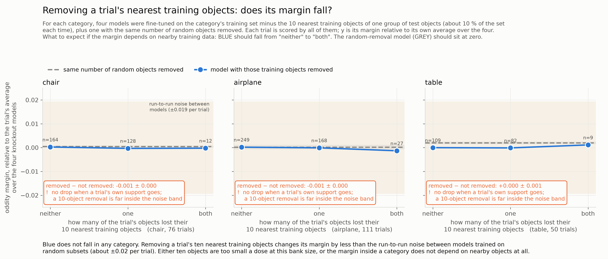
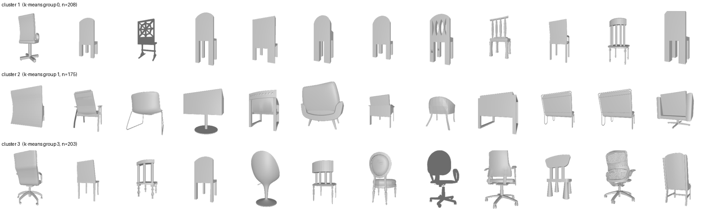
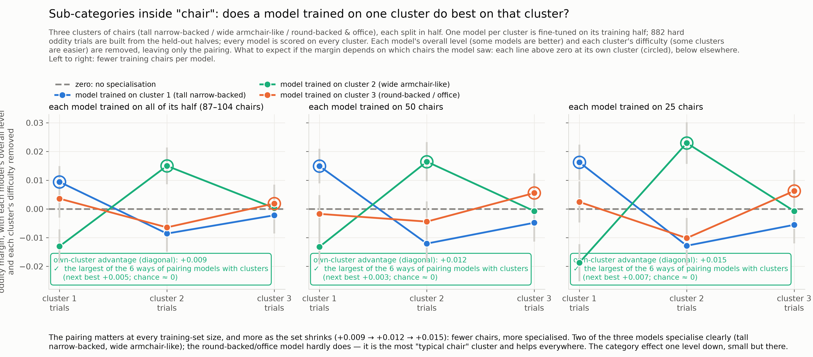
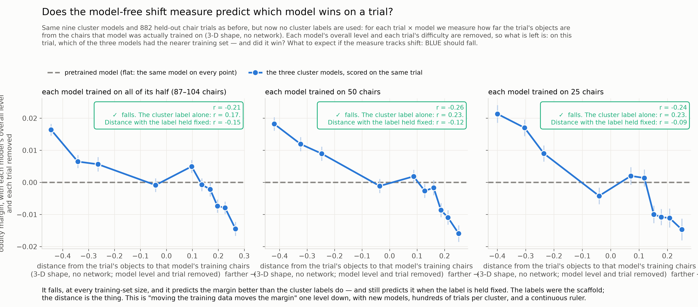

# Changing the training data within a category: one experiment failed, the next one worked
We trained new models on chosen subsets of the chair category and asked whether the margin follows how far the test objects are from what each model saw. The first round, designed by the agent, removed or added a few dozen objects and measured on the MOCHI trials; it showed nothing. The second round, designed by the lead, trained models on distinct kinds of chair and measured on hundreds of trials built from held-out chairs; it showed the effect, and the model-free distance predicts it.

*Snapshot: 2026-09-20 — the live state; the maintained version is [STATE.md](../STATE.md) · Lead: TB* · ← [previous](05-the-within-category-limit.md) · [index](README.md) · [resources](../RESOURCES.md)

## Goal
Find a way to use the oddity margin as a proxy for distribution shift — the distance between what a model was trained on and what it is tested on — and establish that it really is one: a shift estimate the margin tracks, computed in a way that cannot be gamed. The NeurIPS reviews questioned whether the manuscript's estimate measures shift at all. We are working out how much of that to take on board and how much to set aside, by testing rather than arguing.
## Status
**Where we were.** We had shown that the margin tracks *which category* a model was trained on, and that inside a category nothing could be shown with the models we had, because each had seen its whole category: "far from the chair training set" and "an unusual chair" were the same fact. The way through was to train new models on chosen subsets of a category, so that the training set varies while the test trial stays fixed.

**The first round, and why it showed nothing.** The agent designed it: fine-tune models on the chair, airplane or table training set minus the ten training objects nearest to a group of test objects (about 10 % of the set), plus models trained on random sets of 100 chairs, and measure on the MOCHI trials — 76 chair trials. Twenty-two models, about $180. Removing a trial's nearest training objects changed its margin by 0.001, against a run-to-run difference of 0.02 between any two models trained on different data. The models with 10 % removed were, to three decimals, the same model as the one trained on everything. Two things had been misjudged. The dose: the training procedure draws the same 20,000 image triplets per epoch whether the bank has 100 objects or 2,000, so removing 200 of 2,000 barely changes what the model sees, while 100 chairs train it as fully as 2,000 do. And the test set: MOCHI's 76 chair trials were selected to be hard for the pretrained model, so inside the category the unusual chairs are the *easy* trials — the difficulty confound again, with the opposite sign. A side result of that round: our training pipeline does not reproduce the collaborator's original models (0.155 against 0.241 on the same 2,000 chairs; the difference is somewhere we cannot see), so nothing we train can be compared to the original twelve. The one thing that round did show was in its cheapest arm: across eight models trained on eight random sets of 100 chairs, the model whose chairs sat nearer a trial gave it a slightly bigger margin (r = −0.10, permutation p = 0.011). Below: what to expect from the knockout if the margin depends on nearby training data is a fall from "neither" to "both"; there is none, at a scale where the noise band is ±0.02 [[D17](../REASONING.md#D17), [D18](../REASONING.md#D18)].

**The second round: sub-categories, and trials built from the bank.** The lead's design. We know category membership moves the margin; so find categories *within* the category and check that they do too, and use that to learn what the assay needs. The 2,000 chairs were clustered on their 3-D shape and the three most separated clusters kept — tall narrow-backed chairs, wide low armchair-like chairs, round-backed and office chairs (below). Each cluster was split in half. One model per cluster was fine-tuned on its training half, at three sizes (all of it, about 90–100 chairs; 50; 25). Test trials were built from the held-out halves — 882 hard oddity trials, each object against one of its ten nearest held-out neighbours — so that every model is scored on every cluster, on hundreds of trials instead of 76, with no MOCHI selection. Nine models, about $65. As a check of the new test set, the original twelve category models were scored on it: the chair model far ahead, then bench, the pretrained model at the bottom — the ordering of the other eleven cannot be memorisation [[D19](../REASONING.md#D19), [D21](../REASONING.md#D21)].

**It works.** With each model's overall level and each cluster's difficulty removed, what is left is the pairing: does a model do better on the kind of chair it was trained on? Expect each line above zero at its own cluster and below elsewhere. That is what happens, at every training-set size, and the effect *grows as the training set shrinks* — +0.009 with ~100 chairs, +0.012 with 50, +0.015 with 25: fewer chairs, more specialised. Two of the three models specialise clearly; the round-backed/office model hardly does, because it is the most typical kind of chair and helps everywhere. The effect is small — a hundredth or two of margin against a per-trial spread of two hundredths — and it is the largest of the six possible ways of pairing models with clusters, at every size [[D21](../REASONING.md#D21)].

**And the shift measure predicts it without the labels.** Throw the cluster labels away and, for every trial and every model, measure our distance: how far the trial's objects are from the chairs that model was actually trained on, on 3-D shape, no network. Expect the margin to fall with it. It does, at every size (r = −0.21 to −0.26 within trial), it predicts the margin *better* than the cluster label does (+0.17 to +0.23), and it still predicts it when the label is held fixed (−0.09 to −0.15). The labels were the scaffold; the distance is the thing. This is the same result as with the twelve category models — moving the training data moves the margin, and a distance measured on the objects says by how much — one level down, with models we trained, hundreds of trials per cluster, and a continuous measure [[D22](../REASONING.md#D22)].

**What is still not shown, and two things learned about the measure.** Inside a single cluster with its single model, distance and margin are again confounded with how unusual the object is (the pretrained model shows the same pattern on the same trials); a graded within-cluster result needs the training set to vary *within* the cluster. On the measure itself: counting nearby training objects, our best score on the 2,000-object banks, does worse than nearest-neighbour distance here, because with 25–100 training objects most counts are zero — the count saturates where the distance still varies. So: distance for small training sets, counts for large banks, and say why. And the run-to-run floor — two models trained on identical data with different seeds — is still being measured.

**Who did what.** The first round was the agent's design and did not work; the second was the lead's and did. The difference was not the metric but the experiment: a dose the training procedure can register, and a test set large and unselected enough to see it.

## Strategy
Ask the graded question at the operating point the calibration found: training sets of 25–50 objects, hundreds of bank-built trials, statistics with model level and trial difficulty removed, seed replicates for the floor. For held-out chairs, train on the 50 *nearest* chairs, 50 *random*, and 50 *farthest*, and relate the margin change on trials around those chairs to the distance — the targeted intervention, done where it can be seen. Then the same in a second category.

## Resources used
| | this state | cumulative |
|---|---|---|
| agent time | 12 h | 46 h |
| lead time (guess) | 5–6 h | 22–23 h |
| compute, unsub / sub | $247 / $55 | $272 / $61 |

Compute (from the ledger): first round 22 fine-tunes + the full-bank replication ≈ $180 / $40; second round 9 cluster fine-tunes, 13 evaluations and 2 seed replicates ≈ $65 / $15. 60 GPU-hours in total across the project.

## Next steps
- [ ] Seed floor from chair_c0_all seeds 43 / 44 (running).
- [ ] Nearest / random / farthest 50-chair subsets around held-out chairs; margin change vs distance.
- [ ] Repeat the sub-category calibration in a second category (airplane).
- [ ] Decide how the manuscript states the measure: distance for small training sets, counts for large banks.

## Open questions
- Is the within-cluster relationship graded once the training set varies inside a cluster?
- How much of the cluster effect survives the seed floor?
- Why does our pipeline give 0.155 where the collaborator's gave 0.241 on the same chairs?
