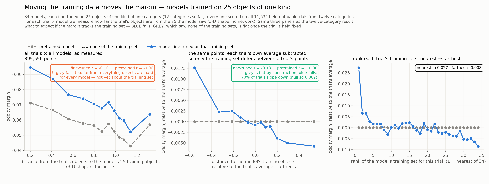
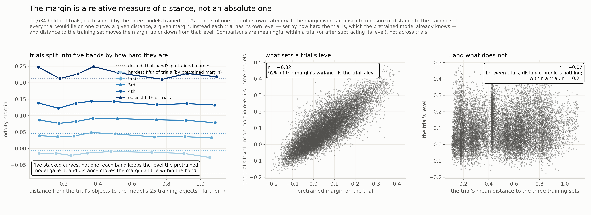

# Every category at once, and what the margin turns out to be
The sub-category design was run in all twelve categories and the earlier analysis reproduced on it. Then a simple question — is the margin an absolute measure of distance or a relative one? — turned out to have a sharp answer: most of a trial's margin is where pretraining left it, distance to the training data moves it from there, and how much is "where pretraining left it" depends on how gently the model was fine-tuned.

*Snapshot: 2026-09-21 · Lead: TB* · ← [previous](06-changing-the-training-data.md) · [index](README.md) · [resources](../RESOURCES.md) · next → [next](08-what-the-distance-is.md)

## Goal
Find a way to use the oddity margin as a proxy for distribution shift — the distance between what a model was trained on and what it is tested on — and establish that it really is one: a shift estimate the margin tracks, computed in a way that cannot be gamed. The NeurIPS reviews questioned whether the manuscript's estimate measures shift at all. We are working out how much of that to take on board and how much to set aside, by testing rather than arguing.
## Status
**Where we were.** We had shown, in one category, that models trained on 25 chairs of one kind do best on that kind, and that a distance measured on the objects' shape predicts which model wins a trial without being told the labels. The question was whether that held everywhere, and what the simplest form of the experiment was.

**All twelve categories.** The lead's design, applied without change to every category: cluster each category's objects on their shape, keep the three most separated kinds, split each in half, train one model per kind on 25 objects of its training half, and build hard oddity trials from every held-out half — 11,634 trials over twelve categories, every model scored on every trial. Thirty-three new models, about $250. The analysis that worked with the original twelve category models was run on these unchanged, and gives the same three pictures: as measured, the pretrained model's margin falls with distance too (objects far from everything are hard for everyone); hold the trial fixed and the pretrained model is flat while the fine-tuned margin falls, in 70 % of trials; rank each trial's training sets from nearest to farthest and the margin steps down, steepest over the first few ranks — the trial's own category — then graded [[D27](../REASONING.md#D27), [D29](../REASONING.md#D29)]. Below: what to expect is blue falling and grey flat once the trial is held fixed.

**Two things learned about the design along the way.** The effect of *which* objects a model saw is largest with the fewest objects (about 0.015 of margin at 25, half that at 100), while the effect of fine-tuning on anything at all saturates by 25 objects — the pipeline draws the same number of image triplets per epoch whatever the bank size, so more objects never means more training [[D24](../REASONING.md#D24)]. And random subsets work as well as clusters, per unit of contrast they create: the clusters were a scaffold, not the finding [[D23](../REASONING.md#D23), [D26](../REASONING.md#D26)].

**A plot that looked wrong, and what it taught.** The margin against distance with nothing normalised *rose* with distance before falling, which made no sense. The reason was the test set: each trial pairs an object with a near neighbour, and an object far from the training data sits in a sparse region of shape space, so its neighbour is also far, so the pair differs more, so the trial is easier — for every model. Distance to training correlated 0.81 with the distance between the trial's own two objects; hold that fixed and the rise vanished. It is the manuscript's floor reappearing on the test-set side, and it is why every raw plot in this project wobbled and every held-the-trial-fixed plot did not [[D26](../REASONING.md#D26)].

**Is the margin an absolute measure of distance, or a relative one?** The lead's question, and the reviewers'. Absolute would mean one curve: a given distance, a given margin, whichever trial. Relative would mean each trial has its own level and distance moves the margin from there. The data say relative, plainly: 92 % of the margin's variance is the trial's level; that level is the *pretrained* model's margin on the same trial (r = +0.82) and not the trial's distance to the training data (r = +0.07); within a trial, distance does its work (r = −0.21). Split trials into five bands by difficulty and you get five stacked curves, not one. Held fixed on one trial and retrained at different distances, the margin moves by about 0.02 across the whole range — inside the scatter between models on that trial, visible only when averaged over many trials [[D31](../REASONING.md#D31), [D32](../REASONING.md#D32)]. Below: expect one curve if absolute, stacked curves if relative.

**Why relative — and a ladder to test it.** The level is pretraining's verdict on the trial, and the fine-tuning we had been doing is a small perturbation of that prior. If so, overwriting more of the prior should shrink the level's share. We trained the three chair models at three strengths: the gentle setting we had used, a ten-times larger learning rate, and a full fine-tune; and one model from scratch, with no pretraining at all, on all 2,000 chairs. The level's share of the margin fell from 85 % to 54 % to 45 %; its correlation with the pretrained margin from 0.79 to 0.44 to 0.34, and to 0.28 with no pretraining; and the effect of which objects the model saw more than doubled. "Relative" is a property of the regime, not of the margin. But nothing absolute took its place: the from-scratch model was weak (it scored below a pretrained model that had never seen a chair), and its margin did not follow distance to its training data either — what remains of the level with no prior is trial difficulty and noise [[D33](../REASONING.md#D33), [D34](../REASONING.md#D34), [D35](../REASONING.md#D35)].

**What this means for the claim.** The margin reads distance to the training set *relative to what the model already had*; how much of the margin is "already had" is set by the training regime; comparisons are meaningful within a trial, or after subtracting the trial's level. That is the reason for comparing models on the same trial, stated as a property of the measure rather than a convenience — and it is the structure the human claim inherits, since a lifetime of vision is the prior and the experiment's exposure is the fine-tuning.

## Strategy
The margins are now measured under a controlled intervention and we trust them. The distance measure is still the one we assumed. Search over it: many ways of describing an object, many ways of comparing a trial with a training set, each scored on how well it predicts — within a trial, on held-out images — which training set gave the bigger margin.

## Resources used
| | this state | cumulative |
|---|---|---|
| agent time | 14 h | 60 h |
| lead time (guess) | 4 h | 26–27 h |
| compute, unsub / sub | $150 / $34 | $422 / $95 |

Compute (from the ledger): 33 cluster fine-tunes and their evaluations on 11,634 trials ≈ $110 / $25; the ladder (six fine-tunes, one from scratch, one control) ≈ $40 / $9. About 95 GPU-hours across the project so far.

## Next steps
- [ ] The search over distance measures, scored on held-out trials.
- [ ] The same measures on images the models never trained on from a different pipeline (MOCHI).
- [ ] Trials built from the models' own training objects, as the anchor at distance zero.

## Open questions
- Does any model-free description put different categories on one axis, or is "graded within, a step across" a fact about geometry?
- With no prior at all, can a strong enough model make the margin an absolute function of distance? (The from-scratch run says not with one training set.)
