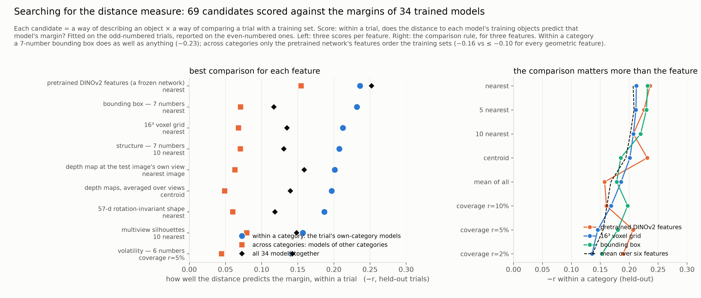
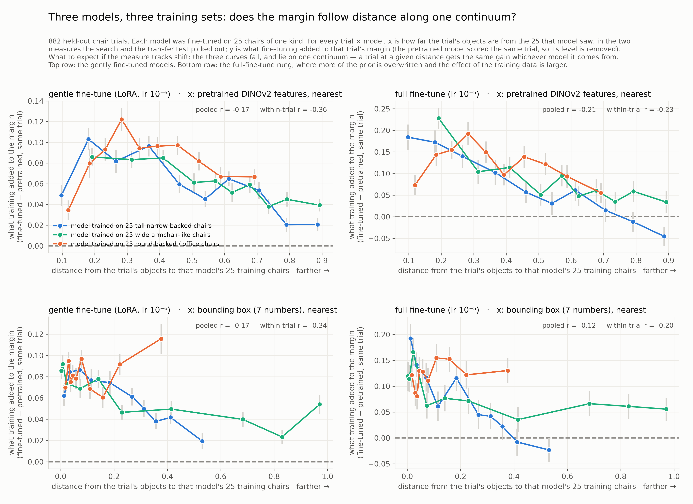

# Searching for the distance measure against margins we now trust
With the margins measured under a controlled intervention, the distance measure could finally be searched for rather than assumed. Within a category everything reasonable ties, and a seven-number bounding box is as good as any; across categories only a frozen pretrained network's features put different training sets on one scale; and with that measure, models trained on different subsets fall along one continuum.

*Snapshot: 2026-09-21 — the live state; the maintained version is [STATE.md](../STATE.md) · Lead: TB* · ← [previous](07-what-the-margin-is.md) · [index](README.md) · [resources](../RESOURCES.md)

## Goal
Find a way to use the oddity margin as a proxy for distribution shift — the distance between what a model was trained on and what it is tested on — and establish that it really is one: a shift estimate the margin tracks, computed in a way that cannot be gamed. The NeurIPS reviews questioned whether the manuscript's estimate measures shift at all. We are working out how much of that to take on board and how much to set aside, by testing rather than arguing.
## Status
**Where we were.** Every result so far used one distance measure, chosen early: the objects' 16³ voxel grid, compared by the mean distance to the nearest training objects. The lead's worry was the right one: we trust the margins now, but the measure is an assumption. And there was a known limit — on that measure, distance was informative inside a category and carried no ordering between categories.

**The search.** Sixty-nine candidates: eleven ways of describing an object (three voxel resolutions; a 57-number rotation-invariant shape summary; the bounding box; two small structural summaries; multiview silhouettes; depth maps, both averaged over views and at the test image's own view; and the pretrained DINOv2 network's features, a frozen space the models did not train in) crossed with eight ways of comparing a trial with a training set (nearest; 5 and 10 nearest; mean over all; centroid; count within a radius at three radii). Each scored on one thing: within a trial, does distance to each model's training objects predict that model's margin? Fitted on the odd-numbered trials and reported on the even-numbered ones, so nothing is tuned to noise [[D36](../REASONING.md#D36)]. Below: expect a spread if the measure matters, a tie if it does not.

**What it found.** Within a category, the top of the ranking is flat at about −0.23, and the crudest model-free description — a seven-number bounding box — reaches it. The frozen network's features are marginally best (−0.236 vs −0.232). Across categories, the geometric descriptions give up (every one ≤ −0.10) and the frozen network's features order the training sets (−0.155): on shape geometry, 25 airplanes and 25 benches are equally far from a chair; in the network's space they are not. The comparison rule matters more than the description and is the same everywhere: nearest-few beats centroid beats mean-over-all beats counting within a radius — counting, our best rule on 2,000-object banks, is the worst at 25 objects, where most counts are zero. Viewpoint does not help: the depth map at the test image's own view scores the same as the view-averaged one.

**On images the models never trained on, from a different pipeline.** The same measures applied to the MOCHI trials — the manuscript's own images, rendered differently — scored by the same models. The frozen network's distance transfers best (−0.26 within a category, −0.16 across); the bounding box holds (−0.17); the voxel grid and the structure summary lose most of their signal (−0.09, −0.07): they had been partly fitting the bank's rendering [[D37](../REASONING.md#D37)].

**The plot the lead asked for.** Three models trained on three different sets of 25 chairs; on x, distance from a trial to *that* model's training chairs; on y, what training added to the margin (the pretrained model scored the same trial, so its level is removed). With the frozen network's distance the three curves fall and lie on one continuum — a trial at a given distance gets the same gain whichever model it comes from — and under full fine-tuning the gain runs from +0.18 near the training data to zero far from it, going *below* zero on the farthest trials: fine-tuning on distant data made those trials worse than no fine-tuning at all. With the bounding box, each model's curve falls but the three do not share an axis [[D38](../REASONING.md#D38)]. Below: expect falling curves, and one continuum if the measure puts different training sets on one scale.

**Where the claim stands.** Within a category the result can be made with a description nobody could accuse of hiding a model. Across categories it needs a learned space, and the honest caveat is that the fine-tuned models were initialised from that very network, so part of what its space orders is the prior they inherited — not the manuscript's circularity (the measuring space is frozen and the margins come from other models), but not nothing. Pending: trials built from each model's own 25 training objects, which give the continuum its left end at distance zero and a second, independent test of every measure — a model's own objects must come first.

## Strategy
Score the 69 measures on the training-object trials when they land; a measure that fails the anchor is out whatever its held-out score. Then write the paper's within-category figure from the continuum plot (full fine-tune, frozen-network distance, bounding box in the supplement), and state the two-scale result — graded within a category, a step across categories on geometry, one axis in a learned space — as the finding.

## Resources used
| | this state | cumulative |
|---|---|---|
| agent time | 8 h | 68 h |
| lead time (guess) | 3 h | 29–30 h |
| compute, unsub / sub | $27 / $6 | $449 / $101 |

Compute (from the ledger): the search itself ran on the login node; the MOCHI and training-object evaluations ≈ $27 / $6. 100 GPU-hours across the project.

## Next steps
- [ ] Training-object anchor: score all measures; every model's own objects first.
- [ ] Paper figures: the continuum plot; the twelve-category reproduction; the ladder.
- [ ] The human side: the same level-plus-shift structure, stated and tested.

## Open questions
- How much of the frozen network's cross-category ordering is the prior the fine-tuned models inherited from it?
- Does the negative transfer at far distances appear in people?
